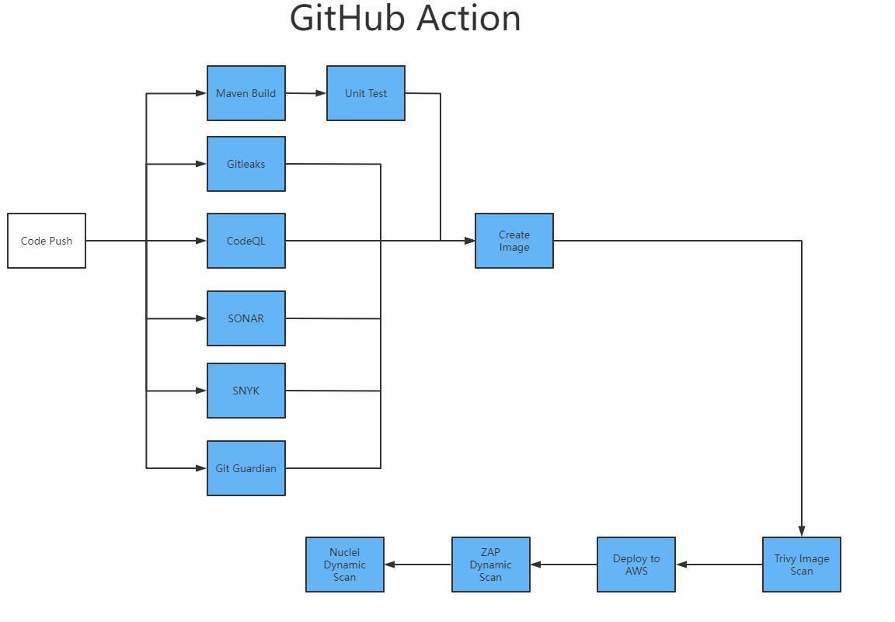

Secure Flow
=================

Secure Flow is a GitHub Action pipeline with security features for Maven projects. It uses varieties of security tools to eliminate vulnerabilities happens in the development process, bringing developers a clear view of the quality of the project.

Structure
----------

## Modules
>
>
> | Name        | Description |
  > | -------------- | ----------- |
> | Gitleaks    | Gitleaks is a SAST tool for detecting and preventing hardcoded secrets like passwords, api keys, and tokens in git repos. |
> | GitGuardian    | GitGuardian is a secret scanning tool for scanning your source code to detect api keys, passwords, certificates, encryption keys and other sensitive data in real-time. |
> | CodeQL           | Discover vulnerabilities across a codebase with CodeQL, our industry-leading semantic code analysis engine.|
> | Semgrep          | A fast, open-source, static analysis engine for finding bugs, detecting vulnerabilities in third-party dependencies, and enforcing code standards.|
> | Sonar     | Enable your team to deliver clean code consistently and efficiently with a tool that easily integrates into the cloud DevOps platforms and extend your CI/CD workflow.|
> | Snyk     | Find and automatically fix vulnerabilities in your code, open source dependencies, containers, and infrastructure as code.|
> | Create Image   | Create a docker image containing the project |
> | Trivy   | Trivy (tri pronounced like trigger, vy pronounced like envy) is a comprehensive security scanner. |
> | Deploy| Upload the image to ECR, and deploy it to ECS|
> | ZAP | Web app vulnerbility |
> | Nuclei       | Nuclei is used to send requests across targets based on a template, leading to zero false positives and providing fast scanning on a large number of hosts. |

## How to Use

### Config

#### SONAR
- secrets.SONAR_TOKEN  
- Dsonar.projectKey

#### Gitleaks

#### GitGuardian
- secrets.GITGUARDIAN_API_KEY

#### Semgrep

#### CodeQL

#### snykScan
- secrets.SNYK_TOKEN

#### deploy
- secrets.AWS_ACCESS_KEY_ID
- secrets.AWS_SECRET_ACCESS_KEY
- env.AWS_REGION
- env.ECS_SERVICE
- env.ECS_CLUSTER
- env.ECS_TASK_DEFINITION //aws/task_definition.json
- evn.CONTAINER_NAME

### File
 - AWS Definition for deployment  
   https://docs.aws.amazon.com/AmazonECS/latest/developerguide/task_definitions.html  
   https://github.com/cl456852/jpetstore-6/blob/master/aws/task_definition.json
 - Docker File for creating docker image  
   https://github.com/cl456852/jpetstore-6/blob/master/Dockerfile

## License
[MIT](https://choosealicense.com/licenses/mit/)
